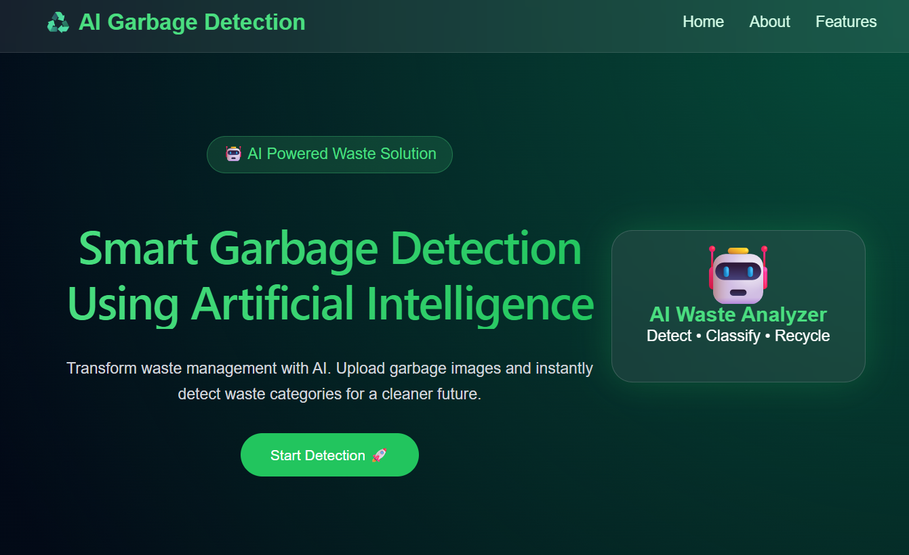
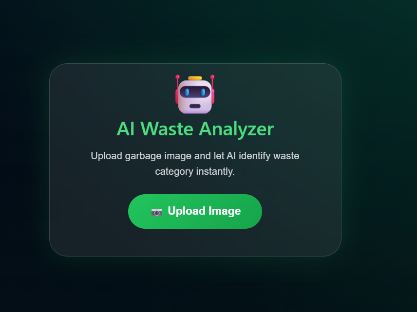
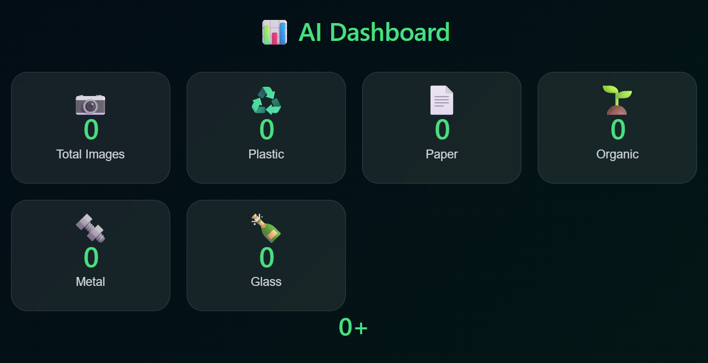

\# ♻️ AI Garbage System

\## Overview

AI Garbage System is an AI-based waste classification project designed to identify different types of garbage using image recognition technology. The system helps in improving waste segregation and supports smart waste management.

\## Features

\- Upload garbage images

\- AI-based waste classification

\- Smart garbage identification

\- User-friendly interface

\- Environmental sustainability support

\## Tech Stack

\### Frontend

\- React.js

\- JavaScript

\- CSS

\- HTML

\### Backend

\- Node.js

\- Express.js

\### AI / ML

\- Image Classification Model

\- Computer Vision

\## Project Structure

AI-Garbage-System

│

├── frontend

├── backend

└── README.md

\## Installation \& Setup

\### Frontend

cd frontend

npm install

npm start

\### Backend

cd backend

npm install

npm start

\## Future Improvements

\- Real-time garbage detection

\- Smart dustbin integration

\- Mobile application

\- Cloud deployment

\## Author

Soham Patel

## Screenshots

### Home Page

### Upload Page

### result Page

